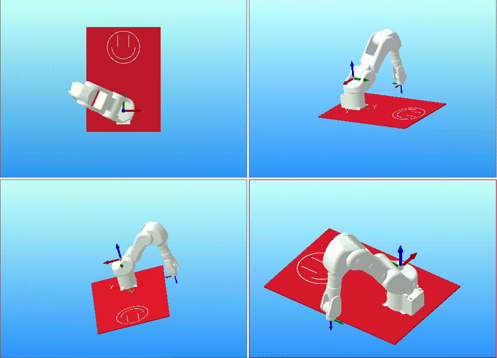
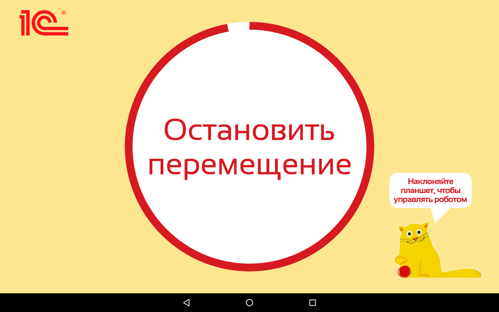

# "Вытащи игрушку"
Данное приложение поволяет управлять роботом в игре "Вытащти игрушку"
## Пример работы программы

    

## Экраны
На данном рисунке показаны оснавные экраны

    

### Главного экрана

    

### Первого экрана игры наклоном   
на котором робот перемещается по осям X, Y

    

### Когда прошло немного времени

    

### Второго экрана игры наклоном, на котором робот перемещается по оси Z

    

### Экран, который появляется, когда закончилось время

    

### Экран настроек

    

